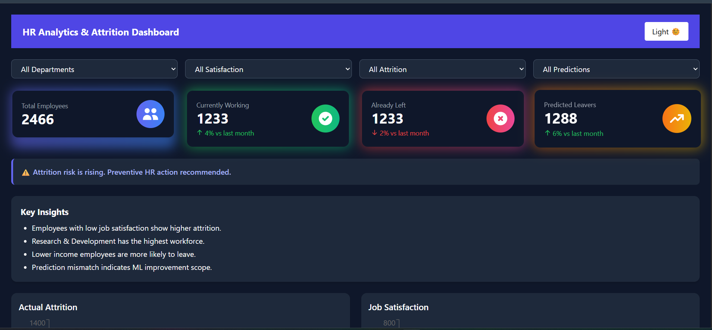
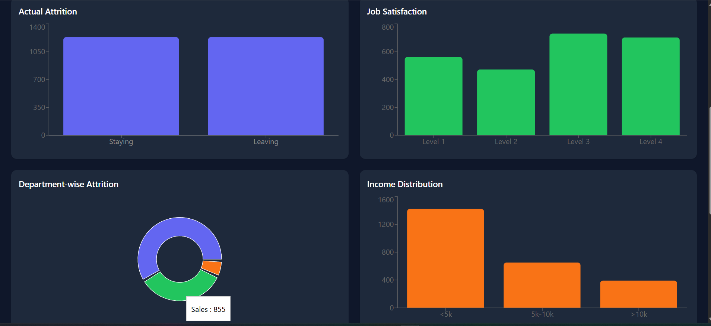
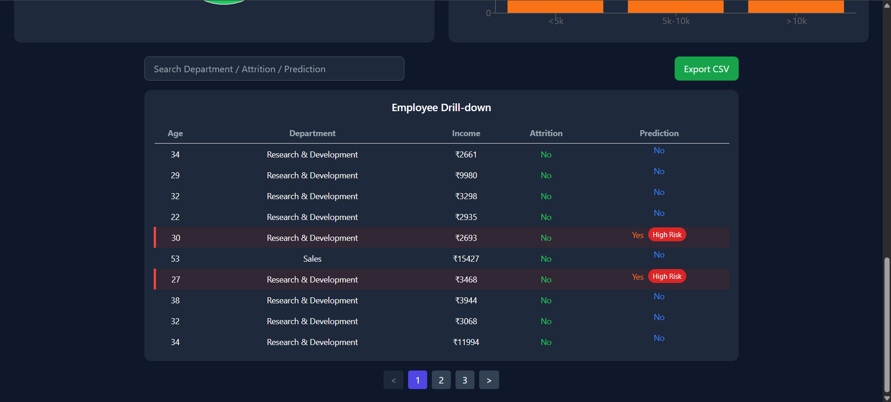
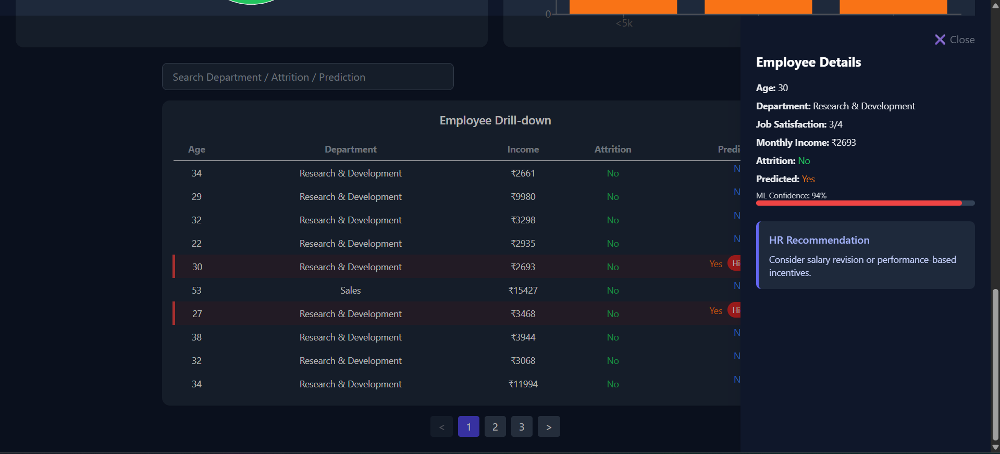

ML + JSON + MongoDB   DONE
Node + Express API   NEXT
React Dashboard      AFTER

How to Run Backend

backend> node server.js

How to Run Frontend

backend\frontend> npm start

API Test URL

http://localhost:5000/api/employees

UI Design Tools Used

Figma AI
Galileo AI
Uizard
Other UI-AI Tools

------------------------------------------------------------

Major Internship Project – HR Analytics & Employee Attrition Prediction System

This project is a Major Internship Project developed during an internship at Naviotech Solutions under the domain of Machine Learning with Python and Data Visualization.

The project focuses on analyzing employee data to understand employee attrition patterns and predicting whether an employee is likely to leave the organization in the future.

An end-to-end HR Analytics Dashboard has been built using the MERN stack, enabling real-time insights, predictive analysis, and actionable HR recommendations.

------------------------------------------------------------

Objectives

Analyze employee data using visualization techniques

Identify factors contributing to employee attrition

Predict future employee attrition using machine learning

Visualize insights through an interactive dashboard

Assist HR teams in proactive employee retention strategies

------------------------------------------------------------

Dataset Overview

The dataset consists of employee-related attributes such as:

Age
Department
Job Satisfaction (1–4 scale)
Monthly Income
Attrition (Yes / No)

The dataset was cleaned and balanced to handle class imbalance before training the machine learning model.

------------------------------------------------------------

Key Features

Interactive HR Analytics Dashboard

Machine Learning-based Attrition Prediction

ML Confidence Meter (0–100%)

High-Risk Employee Identification

HR Recommendation Engine

Search & Pagination for large datasets

Light and Dark Mode UI

CSV Export of filtered employee data

------------------------------------------------------------

Machine Learning Approach

Binary classification model used for attrition prediction.

Model Outputs:

Attrition prediction (Leave / Stay)

Confidence Score (0–100%)

The confidence score helps prioritize high-risk employees.

------------------------------------------------------------

System Architecture

MongoDB → Node.js & Express.js → React.js Dashboard

Frontend: React.js, Tailwind CSS
Backend: Node.js, Express.js
Database: MongoDB
Machine Learning: Python

------------------------------------------------------------

Business Impact

Early identification of employees at risk of leaving

Reduction in employee turnover costs

Improved HR decision-making

Enhanced employee retention strategies

------------------------------------------------------------

Project Screenshots

  

  

  

corphrAdmin  user name 
RuEVnMWowdyfLRON mongoDB password
------------------------------------------------------------

Developed by Tamanna